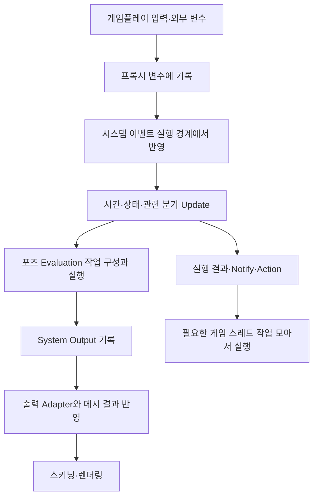

# UAF 실행 구조·사용법과 TDGame 애니메이션 설계 연구

### 요약

**UAF(Unreal Animation Framework)는 애니메이션을 언제 실행하고, 어떤 입력·상태·계산을 사용하며, 결과를 어디에 전달할지 구성하는 차세대 애니메이션 프레임워크다.** 핵심 학습 가치는 단순한 공유 포즈 확대보다, CPU 작업의 실행 경계와 데이터 소유권을 정리하고 필요한 동작만 조합하는 설계에 있다. UE 5.8.2의 공식 상태는 `Beta`가 아닌 `Experimental`이다.[^1][^4][^10]

The Witcher 4 기술 데모에서 UAF를 사용한 것은 공식적으로 확인된다. 그러나 데모의 60fps는 UAF·Mass·렌더링·스트리밍 등을 함께 적용한 결과다. 이를 UAF 하나의 성능이나 TDGame의 500마리 전투 성능으로 환산할 수는 없다. UAF를 깊이 이해한 뒤 **독립적인 시간·입력 상태, 필요한 포즈 작업만 실행, 게임 스레드 작업 묶음 처리, 접촉에 맞는 실행 순서, 전환 이력 보존**을 기존 C++ 구조에 선택적으로 가져오는 것이 이번 연구의 권고다.[^2][^3]

### 접근 방식

- 분석 대상은 설치된 `UE 5.8.2 / CL 56702186`이다. 2025년 UE 5.6 FAQ는 설계 의도, 현재 소스는 실제 지원 구조의 근거로 구분한다. 마지막 확인일은 2026년 9월 10일이다.
- 학습 순서는 용어 → 한 프레임의 실행 → 데이터·포즈 소유권 → 사용 절차 → 전환·접지·전투 → TDGame 차용 아이디어다.
- 엔진이 제공하는 기능, 그 기능에서 도출한 분석, 프로젝트에 제안하는 설계를 구분한다. 같은 이름의 기능이 기존 AnimBP에도 있으면 함께 밝힌다.
- C++ 소스와 공식 문서를 정적으로 검증했다. UAF 에셋을 새로 만들거나 플러그인을 활성화하지 않았으며, 예제 실행·컴파일·콘솔 패키징·성능 측정은 이번 문서의 검증 범위가 아니다.
- 사용 절차는 재현 실험을 위한 가이드다. 런타임 게임 규칙·상태 결정은 C++라는 TDGame 정책을 유지하며, UAF/RigVM 그래프의 일반적인 제작법 설명을 프로젝트의 그래프 로직 허용으로 해석하지 않는다.

### 설명 1. UAF와 위처 4의 관계

2025년 6월 3일 CD PROJEKT RED와 Epic은 The Witcher 4의 세계를 배경으로 한 기술 데모를 공개했다. 공식 발표는 PS5에서 60fps로 실행된 데모에 UAF, Nanite Foliage, MetaHuman과 Mass 등을 사용했다고 설명한다. 양사의 협력은 대규모 오픈월드 기술을 발전시키고 UE 개발자에게 제공하는 범위이며, UAF를 위처 전용 플러그인으로 정의하지 않는다.[^2]

Epic은 이 발표를 실제 The Witcher 4 게임플레이가 아닌 기술 기반의 시연으로 구분했다. 데모의 애니메이션 품질·성능은 주목할 참고 사례지만 공개 발표만으로 그래프 비용, 개별 포즈 수, 전투 판정 비용, 최악 프레임을 분리할 수 없다. ‘위처 데모에서 가능했으므로 같은 설정으로 몬스터 500마리가 된다’는 결론은 성립하지 않는다.[^3]

공식 UAF FAQ는 높은 품질, 조합·재사용, 효율적인 CPU 병렬 실행과 메모리 사용을 목표로 설명한다. 당시에는 장기적으로 Animation Blueprint를 대체하려는 방향과 오랜 공존 기간도 제시했다. 이 내용은 **2025년 UE 5.6 시점의 방향성**이며, 출시 예정일이나 현재 모든 기능의 완성도를 뜻하지 않는다.[^1]

| 시점·근거 | 확인할 수 있는 것 | 현재 판단에 적용하는 방법 |
|---|---|---|
| UE 5.6 공식 FAQ | CPU 워커 실행·조합·재사용·유연한 실행 시점이라는 의도 | 설계 배경으로 읽는다 |
| 위처 4 공식 데모 발표 | 여러 엔진 기술을 함께 적용한 실사용 사례 | UAF 단독 벤치마크로 사용하지 않는다 |
| UE 5.8 공식 릴리스 | root-motion 관련 기능, 입력 포즈 remapping, 이벤트 end tick group 등 변화 | 정확한 API는 5.8.2 소스와 대조한다 |
| 설치된 5.8.2 플러그인 | `IsBetaVersion=false`, `IsExperimentalVersion=true` | 실험적 상태를 현재 사실로 기록한다 |
| 설치된 5.8.2 구현 | 현재 클래스·factory·tick·trait·출력 경로 | 실제 사용 절차와 차용 분석의 기준으로 삼는다 |

UE 5.6 FAQ의 ‘instanced animation 미지원’, ‘abstract skeleton 개발 중’ 같은 문구는 그대로 현재 기능표에 복사할 수 없다. 현재 엔진에는 abstract skeleton 관련 타입과 별도의 instanced 출력·GPU provider가 존재한다. 존재하는 코드의 구체적인 역할을 확인하는 방식으로 판단해야 한다.[^5][^22][^30]

### 설명 2. 무엇이 달라지는가

기존 애니메이션 작업은 흔히 Skeletal Mesh에 AnimInstance를 붙인 뒤 그 안에서 상태·시간·포즈를 관리한다. UAF에서는 실행을 담는 System, 애니메이션 계산을 담는 Graph, 변수를 전달하는 경계, 계산 결과를 소비하는 출력 연결을 더 명시적으로 구분한다. 이를 통해 한 개체의 서로 다른 애니메이션 작업을 적합한 시점과 경로로 배치할 여지가 생긴다.

| 비교 축 | 기존 AnimBP·native 애니메이션 | UAF에서 확인한 구성 |
|---|---|---|
| 실행 호스트 | Skeletal Mesh와 AnimInstance 중심 | System instance와 이벤트, 컴포넌트·factory 연결 |
| 그래프 역할 | 상태·포즈의 기존 AnimGraph 구조 | Trait 조합, update·evaluation 프로그램 구성 |
| 실행 장치 | C++ anim node와 Blueprint 관련 실행 경로 | RigVM 스크립트 경로 및 native script 경로, C++ 평가 작업 |
| 병렬 처리 | 기존에도 병렬 update/evaluation 제공 | 이벤트별 실행 스레드·tick group·의존성 구성 |
| 재사용 | Animation Layer·함수·에셋·포즈 캐시 등 | Graph·Trait·변수 묶음·본/속성 binding 등 |
| 렌더링 | Skeletal Mesh 렌더 경로 사용 | 출력 adapter로 결과를 연결, 렌더 비용은 별도 존재 |
| 군중 공유 | 별도 Animation Sharing 구성 가능 | 같은 Graph asset 사용만으로 최종 포즈 공유가 되지는 않음 |

이 표는 ‘기존 시스템에서는 불가능하다’는 구분이 아니다. 상당수 원리는 기존 C++ 애니메이션에서도 구현할 수 있다. UAF 학습의 목적은 잘 나눈 실행·데이터 경계를 보고, 현재 프로젝트의 복잡한 부분을 더 작고 측정 가능한 구조로 바꾸는 데 있다.

**GPU와의 관계:** UAF의 일반 그래프 실행은 CPU 워커 경로다. GPU에서 메시를 스키닝하는 것, 원본 시퀀스를 GPU에서 개별 재생하는 것, UAF 그래프를 실행하는 것은 서로 다른 작업이다. 이전 500마리 연구의 `AnimSequenceTransformProvider + InstancedSkinnedMesh` 후보는 UAF 전면 도입과 분리해서 검증할 수 있다.[^1][^17][^30]

### 설명 3. 현재 이름과 구성 요소

5.8.2 소스에는 `AnimNext`라는 파일명·구조체·콘솔 변수명이 많이 남아 있다. 현재 노출 이름은 UAF지만, 모든 식별자가 한 번에 같은 이름으로 바뀐 것은 아니다. 이름만 보고 과거 문서와 현재 API를 동일시하면 연결 오류가 생긴다.[^11]

| 개념 | 5.8.2의 대표 타입·이름 | 실제 역할 |
|---|---|---|
| System asset | `UUAFSystem` | 실행 이벤트·구성의 정의 |
| System instance | `FAnimNextModuleInstance` | 개체의 실행 상태·변수·이벤트·tick 수명 |
| Actor component | `UUAFComponent` | Actor와 System 및 출력 메시 연결 |
| Graph asset | `UUAFAnimGraph` | 애니메이션 계산 정의 |
| Graph instance | `FAnimNextGraphInstance` | 그래프의 개체별 실행 상태 |
| Script component | `FUAFScriptComponent` | 이벤트 호출 방식의 경계 |
| RigVM 실행 | `FUAFRigVMComponent` | 이벤트에 해당하는 RigVM 프로그램 실행 |
| 단순 native host | `FUAFSimplePrePhysicsGraphComponent` | 입력 복사·asset 실행·출력을 native 경로로 수행 |
| Trait | `FTrait`와 관련 Shared/Instance data | 재생·동기화·전환 등 동작을 조합 |
| 평가 프로그램 | `FEvaluationProgram`, `FEvaluationVM` | 포즈를 만드는 평가 작업 목록과 실행 상태 |
| 값 전달 | `FUAFValueBundle`, `FPoseValueBundle` 등 | 포즈·본·커브·속성의 값과 접근 구조 |
| 출력 | `FUAFSystemOutputComponent`, `ISystemOutputAdapter` | 계산 결과를 실제 소비 대상에 연결 |

`UUAFSystem`은 `Module/AnimNextModule.h`, `UUAFComponent`는 `Component/AnimNextComponent.h`, `UUAFAnimGraph`는 `Graph/AnimNextAnimationGraph.h`에 선언되어 있다. 비슷한 이름의 `AnimNextAnimGraph.h`는 Graph asset UObject 선언 파일과 구분한다. 에디터 표시 이름도 `UAF System`, `UAF Animation Graph`를 기준으로 확인한다.[^11][^12][^13]

UAF core와 UAF Anim Graph는 별도 플러그인이다. Layering, Warping, Pose Search, Control Rig, State Tree, Mass 등은 관련 확장 영역이다. 단순 애니메이션 학습 때문에 모든 확장을 활성화할 이유는 없으며, 사용할 기능의 직접 의존성부터 선택한다.[^4][^10]

### 설명 4. 한 프레임은 어떻게 실행되는가

다음은 일반적인 System instance 경로를 단순화한 그림이다. 사용자 정의 System의 이벤트 구성에 따라 실제 순서와 실행 지점은 달라진다.

**4.1 초기화 때 실행 순서를 만든다.**

`FAnimNextModuleInstance`는 구현된 이벤트 정보에 따라 `FModuleEventTickFunction`을 생성한다. 이벤트의 `bIsGameThreadTask`에서 워커 실행 가능 여부를 결정하고 `TickGroup`, `EndTickGroup`을 설정한다. 확인한 경로는 같은 instance의 이벤트 사이에 선형 prerequisite를 연결하며, 외부 의존성도 추가한다. 이 tick들은 Level에 등록된다.[^14]

따라서 일반 UAF를 ‘월드 전체의 몬스터를 자동으로 하나의 ECS 배치에 넣는 중앙 계산기’로 이해하면 틀린다. UAFMass는 별도 영역이며, 기본 System instance에도 이벤트별 tick 관리 비용이 있다. 개체를 늘렸을 때 실제 어떤 tick과 작업이 늘어나는지 측정해야 한다.

**4.2 이벤트 실행은 초기화·입력·본문·마무리로 나뉜다.**

`FModuleEventTickFunction::Run`은 사전 작업을 처리하고, 첫 사용자 이벤트에서 워커 binding·필요한 초기화·BeginExecution을 수행한다. 그 뒤 이벤트를 실행하고 결과 이벤트·사후 작업을 처리한다. 마지막 사용자 이벤트는 EndTick으로 이어진다. 이런 경계가 있어 외부 입력이나 게임플레이 반영을 포즈 계산 곳곳에 흩어 놓지 않을 수 있다.[^15]

**4.3 Script 실행 방식과 포즈 계산 방식을 나눈다.**

`RunScriptEvent`는 Script component에 이벤트를 전달한다. RigVM component 경로에서는 실행 문맥을 준비하고 해당 entry의 `ExecuteVM`을 호출한다. 단순 native host에서는 C++ 이벤트가 직접 asset 실행·출력 함수를 호출한다. ‘UAF의 모든 계산이 Blueprint VM에서 실행된다’ 또는 ‘모든 UAF graph가 완전히 native로 변환된다’고 요약할 수 없다.[^17]

**4.4 의존성은 성능 설정이면서 품질 설정이다.**

발 보정이 이동 전 위치를 읽으면 계산이 빨라도 발이 밀려 보일 수 있다. 반대로 모든 개체의 이동·물리·애니메이션을 큰 전역 순서로 묶으면 병렬 실행 기회를 잃는다. 필요한 개체·작업 사이에 의존성을 두고, 어떤 프레임의 변환을 읽는지 정해야 한다.

Post Physics에 보정을 배치할 수 있다는 것은 도구의 유연성이다. 그것이 모든 몬스터의 정답은 아니다. 이동 완료 후 pre-physics 보정으로 충분한지, 물리 결과가 정말 필요한지, 렌더 제출 마감까지 작업이 끝나는지를 함께 비교한다. 한 프레임의 여러 이벤트에 같은 비싼 기본 포즈 평가를 중복 배치하지 않는다.

### 설명 5. 게임 스레드 비용은 어떻게 줄이는가

UAF의 목표를 ‘애니메이션 그래프를 워커로 이동’ 하나로 축소하면 실제 이점을 놓친다. 기존에도 병렬 평가가 있다. 중요한 것은 입력 수집, 평가 후 처리, 이벤트, 메시 관련 작업 중 게임 스레드에 남는 부분을 얼마나 줄이고 잘 모으는가다.

5.8.2의 `ModuleTickFunction.cpp`에는 게임 스레드 작업의 묶음 처리 모드가 있다. 기본값은 module event queue 방식이며, 옵션으로 Task Sync Manager 연결도 지원한다. 이벤트 실행 중 생성된 게임 스레드 작업을 모아 실행하고, 워커에서 디스패치한 경우 완료 의존성에 그 작업을 포함한다.[^15]

이 묶음 처리의 대상은 게임 스레드에 넘길 작업이다. 서로 다른 몬스터의 전체 pose evaluation을 하나의 계산으로 합치는 기능은 아니다. Task Sync 경로에는 실행 환경과 tick group 조건도 있으며, tick이 여러 group에 걸치는 경우 해당 queue 사용을 해제하는 분기가 있다. 특정 CVar를 켜면 항상 빨라진다는 처방 대신 실제 task 수와 완료 대기를 비교한다.[^15]

이는 다음 비용을 줄일 가능성이 있다.

- 작은 게임 스레드 작업마다 별도 task를 생성·디스패치하는 반복 비용.
- 같은 이벤트 안에서 흩어진 결과 반영과 동기화 지점.
- 본 계산 도중 Actor·Component를 직접 건드려 생기는 실행 제약.

반면 실제 피해 적용, 객체 상태 변경, 충돌·물리 연결 등 필요한 일 자체가 없어지는 것은 아니다. EndTick에도 thread-safe action과 게임 스레드 action을 구분하는 코드가 남아 있다. ‘UAF이면 Game Thread 비용 0’이라는 표현은 사용하지 않는다.

**TDGame에 가져올 원리:** 몬스터마다 계산 중간에 게임 객체를 수정하기보다, 작은 입력을 준비하고 워커가 계산한 결과를 정해진 단계에서 반영한다. 효과·표현 통지를 모아 처리할 수 있지만, 게임 규칙상의 순서가 중요한 피해·사망·취소는 원래 의미를 유지한다. 이 구조의 편익은 task 수와 대기 시간, P99 프레임으로 확인한다.

### 설명 6. 입력과 공유 데이터의 소유권

**6.1 같은 에셋을 쓰는 것과 같은 상태를 쓰는 것은 다르다.**

두 몬스터가 같은 달리기 Graph asset을 쓰더라도 재생 시간·블렌드 이력·발 접촉·피격 상태는 달라야 한다. UAF의 Trait 구조는 공유 가능한 읽기 전용 설정과 instance별 상태를 구분한다. `FTrait`의 동작 구현 자체는 여러 instance에서 사용되므로, 개체의 가변 상태를 거기에 넣는 식의 확장은 적합하지 않다.[^18]

| 데이터 | 권장 소유 범위 | 예시 |
|---|---|---|
| 제작 설정 | 에셋·동일 구성에서 공유 | 클립 참조, 기본 블렌드 시간, 본 매핑 |
| 런타임 입력 | 개체·입력 경계 | 실제 속도, 바라볼 방향, 공격 요청 |
| 재생 상태 | 개체·graph instance | 현재 시간, 이전 포즈, 진행 중 전환 |
| 공통 평가 결과 | 명시적으로 같은 입력을 공유하는 집합 | 같은 클립·시간·LOD의 대표 포즈 |
| 지형·상호작용 보정 | 개체 | 발 고정 위치, 경사, 개별 피격 방향 |

UAF의 `Shared Variables`는 변수 묶음과 기본값을 정의하는 자산이다. 현재 구현은 host chain에서 변수 container를 찾으면 참조하고, 없으면 instance가 소유할 container를 만든다. 같은 Shared Variables 자산을 사용한다는 사실만으로 500마리의 속도나 피격 상태가 전역으로 하나가 되는 것은 아니다.[^16]

**6.2 외부 입력은 프록시를 거친다.**

외부 `SetVariable` 경로는 system의 프록시에 값을 기록한다. module instance는 write lock 아래에서 값을 쓰고, `CopyProxyVariables`에서 버퍼 인덱스를 바꾼 뒤 dirty 값만 실제 변수에 복사한다. 단순 native host에서는 asset 실행 전에 이 복사를 명시적으로 호출한다.[^16]

중요한 차용 아이디어는 ‘double buffer라는 이름을 붙인다’가 아니라 **어느 순간의 입력을 한 번의 평가가 사용하는지 결정한다**는 것이다. 속도는 새 프레임인데 방향은 이전 프레임인 상태를 피하려면 관련 입력을 묶어 전달하는 정책도 필요하다. 각각의 setter가 잠금을 사용한다는 사실만으로 여러 필드 전체가 한 시점의 원자적 snapshot이라고 보장되지는 않는다.

메모리에 UObject 포인터를 넣었다고 그 객체를 워커에서 자유롭게 읽고 변경할 수 있는 것도 아니다. 참조의 수명, 데이터 접근 규약, 이동·애니메이션의 실행 순서는 별도로 보장해야 한다. TDGame에서는 필요한 숫자·식별자·불변 설정 중심의 입력 묶음을 먼저 검토하는 것이 단순하다.

**6.3 그래프 정의를 재사용해도 개별 시간은 보존할 수 있다.**

`FAnimGraphFactory`는 구성 recipe를 기준으로 프로그램적으로 생성한 그래프를 만들거나 재사용하는 경로를 제공한다. 같은 계산 구조를 개체마다 별도 에셋으로 만들 필요를 줄일 수 있는 사례다. 그래프 정의의 재사용, 변수 container의 참조, 최종 pose 결과의 공유는 모두 재사용이지만 대상과 수명이 다르다.[^32]

TDGame에도 같은 구분을 적용할 수 있다. 리그별 고정 설정·본 매핑·클립 참조는 공유하고, 몬스터별 시간·전환·행동 상태는 작게 유지한다. 다만 캐시를 추가하기 전에 실제 중복 생성·초기화 비용이 있는지 확인하고, 에셋 교체와 GC 이후의 재생성·참조 수명을 검증해야 한다.

### 설명 7. Trait, Update, Evaluation을 구분한다

**Trait는 재사용 가능한 동작 단위다.** 시퀀스 재생, 시간 동기화, 전환, 관성 블렌드 같은 기능을 조합한다. 이는 C++ 상속 트리를 크게 만드는 대신 필요한 기능을 구성하는 방향이지만, TDGame이 UAF의 모든 인터페이스·registry를 복제할 필요는 없다.

**Update는 시간·상태·관련성을 진행한다.** Sequence Player는 instance의 시간 누산기를 진행하고, 동기화나 전환이 사용할 상태를 준비한다. 여기에서 게임플레이 시간과 시각적 재생 시간이 어긋나지 않도록 입력·중단·루프 정책을 정한다.[^23]

**Evaluation은 현재 상태를 실제 포즈 값으로 만든다.** Sequence Player의 평가 단계는 시퀀스와 시간을 담은 평가 task를 프로그램에 추가한다. `FEvaluationProgram::Execute`는 등록된 task를 순서대로 실행한다. 따라서 평가 task 하나하나가 자동으로 별도의 스레드가 된다고 생각하면 안 된다. 작업 프로그램을 실행하는 문맥의 병렬성과 프로그램 내부 순서가 다르다.[^19][^23]

| 구분 | 질문 | 몬스터 사례 |
|---|---|---|
| 상태·시간 갱신 | 지금 어느 동작의 어느 시점인가 | 공격은 0.24초 진행, 이동 속도는 260 |
| 관련성 결정 | 지금 결과에 필요한 계산은 무엇인가 | 얼굴·상체 피격 레이어는 비활성 |
| 포즈 평가 | 필요한 뼈·커브·속성의 값은 무엇인가 | 이동 시퀀스 샘플링 후 상체 보정 |
| 출력 반영 | 누가 언제 이 값을 사용하는가 | 메시·무기·표현 효과에 결과 전달 |

이 분리를 이용하면 낮은 중요도 개체에서 포즈 평가 빈도를 줄이면서 논리적 시간은 유지하는 설계를 생각할 수 있다. 그러나 UAF에서 update를 생략해도 모든 notify·root motion·동기화가 자동으로 정확하다는 보장은 없다. 각 기능이 어느 단계에서 진행되는지 확인하고, 생략 정책을 개별적으로 검증해야 한다.

**평가 프로그램은 전역 군중 캐시가 아니다.** 같은 프로그램·같은 그래프 정의를 재사용해도 입력 시간이나 출력 포즈가 다른 개체의 계산은 남는다. cross-instance 최종 포즈 공유는 별도 정책이다. 반대로 이런 분리 덕분에 공통 기본 포즈만 공유하고 개별 보정은 유지하는 경계를 찾기 쉬워진다.

### 설명 8. 포즈·속성·Abstract Skeleton

포즈를 본 변환 배열만으로 취급하면 root motion, 커브, 접촉 정보, 마스크 등을 주변 코드에서 따로 관리하기 쉽다. UAF에는 값 묶음과 typed pose 접근 구조가 있으며, `FPoseValueBundle`은 본 변환과 float curve 등으로 접근하는 계층을 제공한다. 현재 구현에는 기존 LOD pose와 새로운 값 구조를 연결하는 부분도 공존한다.[^20]

`FUAFSystemOutputComponent`는 실행 시점에 메시·LOD·reference pose를 확인하고, 출력이 쓰이면 serial을 증가시킨다. 결과를 읽는 쪽은 자신의 serial과 비교하여 변경 여부를 판단할 수 있다. 이것은 출력의 갱신 여부를 명시적으로 전달하는 사례다. 그 자체로 모든 본 변환·GPU 업로드가 자동 제거된다는 뜻은 아니다.[^20]

같은 serial이라도 메시나 LOD가 달라지면 이전 결과를 그대로 사용할 수 있는지 재검토해야 한다. 현재 출력 코드는 한 프레임 안에서 mesh 일관성을 요구하고, 시작 때와 렌더 데이터 생성 때의 LOD가 달라질 수 있음을 고려한다. 캐시의 성능 이점과 무효화 조건은 함께 설계해야 한다.[^20]

**Abstract Skeleton은 의미와 실제 본 이름을 연결하는 계층이다.** Label binding은 의미 있는 label을 실제 bone에 연결하고, Set binding은 본·속성을 집합으로 묶는 구조를 제공한다. 여러 리그에서 `오른손`, `발`, `상체 집합`이라는 역할을 재사용할 수 있는 방향이다.[^22]

UE 5.8 릴리스는 그래프 입력 경계에서의 cross-skeleton remapping도 명시한다. 다만 이름·인덱스 remapping, 비율·기준 자세를 고려하는 retargeting, 최종 발 접지와 품질 보정은 서로 다른 문제다. 이 기능이 존재한다는 이유만으로 이족·사족·날개 달린 몬스터가 동일 그래프와 클립으로 자연스럽게 동작한다고 보장할 수 없다.[^5]

TDGame에서 우선 차용할 것은 필요한 역할별 본 매핑 데이터다. 실제로 필요한 무기·발·골반 정도부터 시작하고, 리그가 바뀔 때 필수 본·상위 체인·LOD 누락을 검증한다. 프로젝트 전체를 위한 범용 추상 스켈레톤 언어를 먼저 만드는 것은 피한다.

### 설명 9. 5.8.2 사용법: 단일 시퀀스로 구조 이해하기

아래 절차는 로컬 소스에서 연결 경로를 확인한 학습용 실험 설계다. 에디터에서 직접 실행하여 성공을 확인한 튜토리얼은 아니며, 실제 검증에서는 작은 실험용 프로젝트나 별도 실험 구성을 사용한다.

**가장 작은 실험은 단일 캐릭터의 루프 시퀀스다.** UAF core와 `UAF Anim Graph` 의존성을 확인하고, Skeletal Mesh와 해당 리그에 맞는 `AnimSequence`를 준비한다. 먼저 원래 재생 경로에서 시퀀스의 방향·스케일·root motion 상태가 정상인지 확인한다.

1. Actor에 `UUAFComponent`를 구성하고 출력 대상 Skeletal Mesh를 명시한다. 출력 대상을 생략할 경우 owner에서 찾는 경로가 있지만, 여러 메시가 있는 캐릭터에서는 명시적 연결이 더 분명하다.
2. 기본 출력 모드 `WriteToSkeletalMeshComponentPose`를 쓸 때는 출력 mesh의 내장 애니메이션 실행을 `SetEnableAnimation(false)`로 비활성화하여 UAF가 포즈를 쓰도록 구성한다. 현재 writer는 `bEnableAnimation=true`이면 경고 후 반환한다. 단순히 Anim Class를 비우는 것과 다르며, Skeletal Mesh의 전체 tick을 끄는 처방도 아니다.[^34]
3. `AssetData`의 Animation Asset 계열 factory에 시퀀스를 지정한다. 현재 factory에는 재생 속도·루프·시작 시간 또는 비율 관련 설정이 있다.
4. C++에서 구성한다면 public `SetAsset`는 **컴포넌트 등록 전**에 사용한다. BeginPlay에서 이미 등록된 컴포넌트에 호출하는 예제는 현재 조건에 맞지 않는다.
5. 컴포넌트 등록·초기화가 system과 출력 연결을 구성하도록 한다. InitMethod와 활성화 상태를 확인한다.
6. 첫 포즈, 루프 경계, 숨김·재표시, 비활성·재활성, 재스폰을 확인한다. 결과가 reference pose이면 입력 asset·출력 연결·내장 애니메이션 flag·활성화·실행 이벤트 순으로 진단한다.
7. 동일 시퀀스의 기존 개별 재생과 포즈·커브·root motion·CPU 비용을 비교한다. 한 마리 실험에서는 구조와 기능을 확인하고 군중 성능 결론은 내리지 않는다.

출력 소유권을 바꾸면 기존 AnimInstance의 tick·notify·root-motion 소비에 영향을 줄 수 있다. 그러므로 첫 실험은 전투 없는 단일 시퀀스로 제한하고, 기존 경로로 돌아갈 때에는 저장한 설정과 관련 실행 상태를 복구한다. 공격 중인 TDGame 몬스터에 이 flag 변경만 적용하는 것을 전투 호환 구현으로 취급하지 않는다.

현재 UAFAnimGraph factory는 Animation Sequence, Blend Space, UAF Graph를 단순 native host로 연결할 수 있다. 따라서 첫 시퀀스를 실행하기 위해 `UAF System` 에셋을 손수 만들고 모든 이벤트를 그래프로 연결하는 것은 필수 절차가 아니다. 단순 경로에서는 native pre-physics 이벤트가 프록시 입력 복사 → asset 실행 → system output 기록을 수행한다.[^12][^13][^17]

| 단일 시퀀스 구성 항목 | 의미 | 첫 실험의 확인 방법 |
|---|---|---|
| `FUAFGraphFactoryAsset_Animation` | System이 호스트할 시퀀스 재생 구성 | 실제 타입이 Animation Asset 계열인지 확인 |
| `AnimationSequence` | 원본 클립 | 출력 mesh와 리그·방향 일치 확인 |
| `PlayRate` | 재생 속도 | 시간 로그와 화면 동작을 함께 비교 |
| `LoopMode` | 반복 정책 | 경계에서 시간·이벤트가 중복되지 않는지 확인 |
| `StartTimeType` | 시작 시간을 표현하는 방식 | seconds/percent 의미를 구분 |
| `StartTimeSeconds`, `StartTimePercent` | 초기 위상 | 같은 클립의 10개체에 다른 시작값 부여 |
| `OutputComponent` | 출력 대상 메시 | 파츠가 여러 개면 자동 검색 결과에 의존하지 않음 |
| `SkeletalMeshComponentOutputMode`·`bEnableAnimation` | 출력 경로와 포즈 작성 주체 | 기본 직접 출력 경로의 내장 애니메이션 비활성 조건 확인 |
| `InitMethod`·활성화 | 초기 포즈·재생 시작·정지 정책 | 에디터 초기화 후 일시정지와 runtime 활성 구분 |

이 값들은 시작 구성과 런타임 제어를 구분해 사용한다. 매 프레임 `AssetData`를 바꾸거나 등록을 반복하는 방식으로 속도·상태를 제어하지 않는다. 변경 가능한 입력은 public 변수 연결이나 적합한 재생·주입 경로로 전달하고, 실패 반환값과 타입 불일치를 검사한다.[^12][^13]

이것은 제작 생산성 관점에서도 중요하다. 기능이 단순한 개체에는 단순한 host를 쓰고, 여러 실행 시점·외부 의존성·맞춤 동작이 필요한 경우에 System 구성을 확장할 수 있다. 모든 캐릭터에 큰 사용자 정의 시스템을 먼저 붙이는 방식보다 비교 범위가 명확하다.

### 설명 10. 그래프와 C++ 기능을 확장하는 순서

**두 번째 실험은 이동 표현이다.** Idle/Move를 구분할 최소 입력, 속도, 방향만 만든다. 먼저 클립 선택·Blend Space·재생 속도가 의도대로 연결되는지 확인하고, 그 뒤에 Sync Group이나 전환 기능을 추가한다. 최초 실험에서 Motion Matching·IK·Control Rig·여러 반응 레이어를 한꺼번에 연결하지 않는다.

**세 번째 실험은 이동 위의 개별 피격이다.** 각 instance에 다른 시점의 이벤트를 주고, 상체 반응이 이동 시간을 초기화하지 않는지 확인한다. 반복 요청·취소·재요청·사망 우선순위를 검증한다. 여기서 같은 그래프 자산과 개별 실행 상태의 차이를 관찰할 수 있다.

**네 번째 실험에서 사용자 정의 System을 학습한다.** 여러 실행 시점을 사용해야 할 때 에디터의 `UAF System`과 `UAF Animation Graph`를 구분한다. System은 호출 순서와 입력·출력 연결, Graph는 포즈를 만드는 동작 구성이라는 역할로 읽는다. 현재 asset 실행·출력 경로의 대표 구현은 `FRigUnit_UAFRunAsset`와 `FRigUnit_UAFWriteSystemOutput`이다.[^13][^17]

일반적인 UAF 제작에서는 그래프와 Trait 구성을 에셋으로 조합한다. TDGame 적용에서는 다음 경계를 유지한다.

| 작업 | 프로젝트 적용 방향 |
|---|---|
| 공격 상태, 대상, 우선순위, 피해 창, 입력 처리 | C++ 게임플레이 로직 |
| 개체별 시간·중단·중요도·평가 예산 | C++ 시스템 로직 |
| 필요한 커스텀 애니메이션 연산 | native 애니메이션 코드·검증된 C++ 확장 |
| 시퀀스·메시·기본값·본 매핑 | 데이터 구성 |
| UAF 그래프에서 분기·계산·상태기계를 작성 | 일반 사용법 학습과 별도로 프로젝트 정책 충족 여부를 검토; RigVM이라는 이유로 우회하지 않음 |

RigVM은 Blueprint VM과 같은 실행 장치가 아니다. 그러나 ‘그래프가 native 연산을 호출한다’는 사실과 ‘프로젝트의 모든 로직이 C++로 작성되었다’는 사실은 다르다. UAF 전체를 채택하지 않고 native host나 일부 원리만 활용하는 선택을 열어 두는 이유다.[^6][^17]

**API의 공개 여부도 확인한다.** `Public` 디렉터리에 있는 헤더 안에도 private 함수가 있다. 예를 들어 `UUAFComponent`의 내부 등록·asset 변환 함수를 프로젝트에서 직접 호출하는 예제로 만들지 않는다. public API, Internal 구현 참고, 에디터 전용 API를 구분하고 실제 구현을 할 때는 모듈 의존성·UHT·쿠킹까지 검증한다.[^12]

**C++만으로 구성할 수 있는 공개 기반도 존재한다.** Graph 측의 `FAnimNextFactoryParams`에는 Trait 추가, stack 간 연결, public 변수 mapping, 초기화 task를 지정하는 함수가 있다. System 측의 `FUAFSystemFactoryParams`에는 public 변수와 component·초기화 task를 추가하는 기능이 있다. 기존 native factory를 작은 범위에서 조합하는 것이 Internal 구현을 직접 호출하거나 별도 VM을 만드는 것보다 우선할 후보다.[^32]

native 조합을 학습할 때는 다음 순서로 읽는다. System에 필요한 입력 구조 정의 → Graph에 필요한 Trait만 구성 → 입력과 Trait 속성 연결 → instance 초기값 설정 → 등록 전 asset 구성 → 실행 후 출력·이벤트 확인이다. 여기서 언급한 빌더 API가 있다는 사실은 프로젝트용 조합 코드의 컴파일·쿠킹 성공을 뜻하지 않는다. 첫 구현은 실제 public 헤더·의존성만 사용한 작은 예제로 검증해야 한다.

### 설명 11. 시간 동기화와 다양성

Sync Group은 관련 애니메이션의 시간·마커를 맞추는 기능이다. 현재 UAF의 sync group 처리는 graph-instance component에 속한다. 이것은 500마리의 포즈를 하나로 합치는 군중 공유 시스템과 다르다.[^23]

한 몬스터 안에서 걷기와 뛰기를 섞을 때 왼발 지지 시점이 맞으면 전환이 자연스러워질 수 있다. 반대로 서로 다른 몬스터 모두를 같은 시간으로 묶으면 군무처럼 보일 수 있다. 따라서 **개체 내부의 동기화와 개체 사이의 위상 다양성**을 동시에 설계해야 한다.

동기화 그룹에서 리더·팔로워라는 말은 그 instance 안의 애니메이션 플레이어 관계를 뜻한다. 일부 follower 플레이어는 이벤트를 발생시키지 않으며, NotifyDispatcher도 이벤트 필터와 dispatch 여부를 확인한다. 이를 Animation Sharing의 follower 몬스터와 혼동하면 공격 이벤트의 소유권을 잘못 설계할 수 있다.[^23][^25]

TDGame의 공유 경로에서는 대표 포즈 집합 사이에 보행 위상의 대응 관계를 두고, 개체는 안정적인 위상·변형 식별자를 가진다. 독립 표현으로 전환할 때 그 개체의 위상을 이어받는다. 이는 UAF의 기본 자동 기능을 설명하는 것이 아니라 시간 소유권 분리에서 도출한 프로젝트 설계 제안이다.

동기화가 발 미끄러짐을 전부 해결하지는 않는다. 접지 구간이 맞아도 이동 속도·보폭·지형 높이·회전이 틀리면 미끄러질 수 있다. 위상 분포, 지지 중 발의 이동, 이동 속도 오차를 각각 측정해야 한다.

### 설명 12. 관성 전환과 비용

일반적인 crossfade는 전환 구간에 이전·새 동작을 함께 평가하고 섞는다. 관성화·Dead Blending 계열은 이전 포즈의 이력과 변화량을 이용해 새 동작으로 수렴시키는 접근이다. 전환 중 이전 그래프를 계속 평가하는 부담을 줄일 수 있지만, 이력 저장과 보정 연산이 필요하다.

로컬 UAF에는 BlendInertializer와 InertializationDeadBlend가 있다. 확인한 경로에서는 관성 전환 요청에 따라 일반 블렌드 시간을 0으로 만들고, 이전 포즈 이력을 이용한 보정이 이어진다. 이를 통해 전환을 수행하는 방법 자체를 동작 선택과 분리하는 원리를 볼 수 있다.[^24]

이 방법이 모든 상태 전환의 정답은 아니다. 양쪽 동작의 지속적인 의미가 필요한 레이어, 물리적 접촉, 공격 궤적에서는 다른 정책이 필요할 수 있다. 공격 취소 때 시각적으로 부드럽게 잔여 동작을 보여주는 것과 실제 공격 판정을 계속 유지하는 것을 혼동하지 않는다.

기존 엔진 애니메이션 런타임에도 Inertialization·DeadBlending이 있다. 따라서 TDGame에서 먼저 비교할 실험은 UAF 전면 이식보다, 선택적 공유↔독립 전환이나 클립 변경에 기존 native 관성 전환을 적용했을 때의 비용·품질이다. UAF의 기여는 기능을 조합하고 실행 책임을 나누는 구조에서도 찾아야 한다.[^21]

### 설명 13. 접지·회전·Root Motion

Warping은 클립의 부족한 방향·속도 표현을 보정하는 수단이다. 그러나 방향 보정, 보폭 보정, 실제 지면의 발 고정은 서로 다른 입력과 이력을 사용한다. UAF Warp 관련 코드가 있다는 사실만으로 지형 추적과 접지가 모두 제공된다고 설명해서는 안 된다.

예를 들어 확인한 StrafeWarping은 방향을 바꾼 발 target에 IK를 적용하고, 현재 LOD에서 없는 다리 뼈를 건너뛰는 경로를 갖는다. 이 처리는 지면 trace와 지속적인 발 planting 전체를 구현한 것과 다르다. 지형 적응은 별도로 어떤 표면·시간·본 체인을 사용하는지 확인해야 한다.[^26]

Root Motion은 포즈를 통해 전달·블렌드·보정할 수 있는 중요한 속성이다. 동시에 실제 이동은 CharacterMovement 또는 다른 이동 시스템의 충돌·제약과 연결되어야 한다. 애니메이션에서 얻은 이동량을 언제 소비하고, 소비된 실제 이동 결과를 어느 보정 단계가 읽는지 정해야 한다.[^1][^25]

권장 학습 실험은 ‘root motion 추출 → 이동 결과 → 최종 포즈 보정’의 시점을 로그에 남기는 것이다. 원하는 delta와 충돌 때문에 실제 이동한 delta가 다를 때 발·공격 궤적이 어떻게 달라지는지 본다. 문·벽·계단에서 테스트해야 평지 루프 재생만으로 놓치는 문제를 찾을 수 있다.

### 설명 14. Montage·Notify와 전투 의미

UAF에는 montage·graph injection·notify를 연결하는 경로가 존재한다. 하지만 구형 AnimInstance에서 동작하던 모든 montage와 notify가 추가 연결 없이 같은 의미로 실행된다고 가정하면 안 된다. 어떤 경로가 legacy montage 지원이고 어떤 경로가 UAF의 개별 asset injection인지 구분한다.[^25]

현재 `MontageLayerDataTrait`는 slot의 활성 여부에 따라 layer enable/disable 이벤트를 보내고 montage의 blend 설정을 전달한다. 이는 필요한 순간에 반응을 추가하는 구성의 근거다. 다만 enable 플래그가 있다는 사실만으로 비활성 레이어의 모든 traversal·평가 비용이 0이 되었다고 단정하지 않는다. 실제 실행된 task와 관련성을 추적해야 한다.[^25]

학습에서 확인할 항목은 시작, blend-in, 타격 구간, 반복, 중단, blend-out, 완료다. 각각의 이벤트에 개체·행동 식별자와 시간을 기록한다. 같은 에셋의 동시 재생이나 낮은 포즈 평가 빈도에서 Notify State 생명주기가 어떻게 처리되는지도 확인해야 한다.

TDGame의 현재 근접 공격은 `UTDAnimNotifyState_MeleeAttack`의 Begin/Tick/End에 연결되어 있다. 원본 시퀀스에서 필요한 뼈를 별도로 샘플링하는 구조가 있지만, 공격 시작·진행·종료의 소유권까지 렌더 표현과 분리된 것은 아니다. 새 애니메이션 경로를 평가할 때 이 비용과 의미를 함께 포함한다.[^29]

차용할 아이디어는 행동의 논리 상태를 C++가 소유하고, 표현 시스템은 그 상태를 따라가도록 경계를 만드는 것이다. 기존 타격 구간 메타데이터를 재사용하여 두 곳에서 공격 타이밍을 따로 편집하지 않게 한다. 처음에는 공격 개체를 기존 경로에 유지해 비교 범위를 줄이고, 실제 필요가 생겼을 때만 전투 시계 연결을 확장한다.

### 설명 15. LOD·Motion Matching·500마리의 비용

LOD에는 서로 다른 축이 있다. 화면에 그릴 지오메트리, 평가할 본·커브, 실행할 보정·레이어, 시간 갱신 주기, 포즈 평가 주기, 데이터베이스 검색 주기를 구분한다. 하나의 거리 값으로 모두 같이 끄는 구성은 빠르게 만들 수 있지만 품질 문제의 원인을 파악하기 어렵다.

UAF Pose Search의 Motion Matching에는 검색 간격을 조절하고 기존 동작을 계속할 수 있는지 확인하는 경로가 있다. 로컬 기본 검색 간격은 0초이며, 이것은 엔진이 자동으로 500개체의 검색 예산을 나누어 준다는 뜻이 아니다. 검색 빈도를 낮추는 설정은 상황 변화에 대한 반응 지연과 함께 측정한다.[^27]

Motion Matching의 좋은 동작 선택, Warping의 방향·보폭 조절, LOD의 계산 절감은 모두 비용을 가진다. 개별 고품질 처리가 쉬워졌다는 이유로 전원에게 모든 기능을 활성화하면 절감한 예산을 다시 소비할 수 있다.

프레임 시간은 모든 워커의 CPU 시간을 더한 값과 다르다. 실무적으로는 게임 스레드 임계 구간·워커 완료 대기·렌더 스레드·GPU 병목을 함께 봐야 한다. UAF 후보가 애니메이션의 게임 스레드 시간을 줄였어도 GPU 그림자나 500개체 전투 sweep이 지배적이면 전체 60fps는 달성되지 않을 수 있다.

이 프로젝트에서의 비용 모델은 다음 항목을 별도로 기록하는 것으로 시작한다.

`입력·스케줄 관리 + 논리 시간·선택 + 포즈 평가 + 개별 보정 + 이벤트·피해 처리 + 출력·스키닝·렌더링`

이 식은 엔진 실행 시간을 단순 합산한 프레임 예측식이 아니다. 측정할 일의 목록이며, 겹쳐 실행되는 작업과 대기 관계는 Insights로 확인한다.

### 설명 16. TDGame에 차용할 아이디어와 우선순위

| 아이디어 | UAF에서 얻은 근거 | TDGame에 적용할 최소 형태 | 절충·검증 |
|---|---|---|---|
| 입력 경계 명시 | proxy·dirty copy | 속도·방향·행동 상태를 묶은 개체별 C++ 입력 | 한 프레임 지연·필드 불일치·객체 수명 |
| 설정과 개체 상태 분리 | Trait shared/instance data | 클립·매핑 공유, 시간·반응 이력은 개체 소유 | 공유 상태 오염·초기화 비용 |
| 시간과 포즈 평가 분리 | update/evaluation | 낮은 중요도는 포즈 빈도만 조절하는 후보 | notify·root motion 누락/중복 |
| 게임 스레드 반영 묶기 | event queue·완료 의존성 | 표현 결과·안전한 후처리를 한 단계에서 반영 | 순서 의미·프레임 말미 집중 |
| 필요한 실행 순서만 연결 | event prerequisite | 이동·기본 포즈·접지 보정 간 의존성 | 과한 전역 직렬화·오래된 입력 |
| 전환 이력 재사용 | inertializer·dead blend | 공유↔독립 또는 클립 전환의 native 실험 | 첫 포즈·잔여 공격·메모리 |
| 역할 기반 본 매핑 | abstract label/set | 발·골반·무기 역할의 데이터 매핑 | 리그·LOD별 누락 검출 |
| 출력 변경 상태 표시 | output serial | 소비자별 마지막 처리 버전·필요 계산 구분 | 새 LOD·mesh 변경 시 무효화 |
| 결과 공유와 제어 상태 분리 | 같은 graph에도 개별 시간 | 대표 포즈는 공유하고 개체 행동은 유지 | 대표 수 증가·전투 의미 |
| 단순한 개체는 단순한 host | native simple asset host | 이동·대기용 작은 평가 경로 | 다른 기능 연결 시 중복 구조 방지 |

**먼저 적용할 가설은 세 가지다.** 입력·행동 시간의 소유권을 명확히 하고, 비활성 레이어와 반복 후처리의 실제 비용을 측정하며, 공유↔독립 전환에서 시간과 포즈 이력을 보존한다. 이는 UAF 전면 도입 없이도 시도할 수 있고 기존 공유 연구의 품질 문제에 직접 연결된다.

그 다음에 선택적 native 보정과 GPU 개별 재생을 비교한다. 중요 개체의 발·전투 표현은 독립적으로 보존하고, 대량 반복 포즈는 공유 또는 GPU 경로에서 처리한다. 어느 경로가 이기는지는 ‘UAF를 닮았는가’가 아니라 동일 품질·동일 전투 조건에서의 전체 프레임과 제작 비용으로 판단한다.

**가져오지 않을 복잡성도 정한다.** Trait registry 전체, 범용 스크립트 VM, 새 ECS, 모든 프로젝트를 포괄하는 skeleton abstraction을 자체 제작할 필요는 없다. 현재 필요한 입력·평가·전환·출력 경계부터 작은 C++ 책임으로 구현한다.

### 설명 17. 채택 수준별 선택

| 수준 | 내용 | 적합한 상황 |
|---|---|---|
| 원리만 차용 | 기존 C++·공유 구조의 입력·시간·후처리·전환 개선 | 현재 구조를 유지하며 품질·병목을 해결할 때 |
| 일부 경로 실험 | 단순 native UAF host, 특정 그래프·기능 실험 | 기존 구현과 비교할 독립적인 검증 장면이 있을 때 |
| GPU 표현 실험 | core 시퀀스 provider·인스턴싱 | CPU 평가·제출 비용이 실제 병목일 때 |
| UAF 기반 시스템 도입 | System·Graph·제작·디버깅 흐름까지 채택 | 기능·성능·C++ 정책·쿠킹·업그레이드 비용이 모두 통과할 때 |

권고는 첫 번째를 기본으로 두고 두 번째·세 번째를 작은 실험으로 비교하는 것이다. Experimental 상태인 프레임워크 전체를 지금 바로 TDGame의 필수 기반으로 바꾸는 결정을 이 문서만으로 내리지는 않는다. 실제 이익이 나온 구간을 확인한 뒤 채택 범위를 넓힌다.

### 설명 18. 학습·검증 실습 순서

| 단계 | 실습 | 이해·검증의 완료 조건 |
|---|---|---|
| 1 | 시퀀스 한 개의 native host | asset→factory→instance→output 경로를 설명하고 재생 확인 |
| 2 | 10개체, 서로 다른 시작 시간·속도 | 같은 asset과 개별 시간의 차이 확인 |
| 3 | Idle/Move와 전환 | update/evaluation과 전환 이력 추적 |
| 4 | 개별 피격·취소 | 같은 frame·다른 frame 이벤트의 주체·순서 확인 |
| 5 | 경사·계단·급회전 | 방향 보정과 지면 접촉의 차이 확인 |
| 6 | 실행 시점·의존성 변경 | 이동 입력의 시점·대기·중복 평가 확인 |
| 7 | LOD·검색·평가 주기 조절 | 품질 오차와 감소한 실제 작업량 연결 |
| 8 | 100→250→500개체 | CPU·GPU·전투 포함 프레임 분포와 메모리 기록 |
| 9 | cooked PC·선택한 콘솔 | 에디터 의존 없이 기능·성능·패키지 검증 |

비교군은 기존 독립 애니메이션, 기존 공유, 공유+선택적 보정, UAF 개별 경로, GPU 개별 재생이다. 메시·카메라·시드·이벤트·LOD·재질·그림자를 맞춘 비용 비교와, 동일한 허용 품질에 맞춘 최종 구성 비교를 분리한다. UAF군만 기능이나 그림자를 줄여 얻은 수치를 시스템 자체의 우위라고 기록하지 않는다.

반드시 다룰 최악 조건은 500마리 동시 피격, 같은 에셋의 중첩 요청, 공격 중 경로 전환, 카메라 줌·회전, 대량 생성·제거, 리그·LOD 변경, 최초 클립 등장이다. 안정 상태의 걷기 평균만으로 채택하지 않는다.

측정에는 median/P95/P99 프레임, 16.67ms 초과 비율, 워커 누적 시간과 대기, 게임 스레드 후처리, 평가·검색·전환 수, 메모리, 공격 이벤트 오류, 발 미끄러짐·전환 팝을 포함한다. 생산성은 클립 수정·새 공격·새 리그 추가에 드는 수동 작업시간과 재컴파일·쿠킹·복구 시간을 기록한다. 상세 성능 실험의 공통 기준은 이전 [500마리 연구 문서](C:/Project/TDGame/Docs/TDMonsterAnimationOptimization_500_Research.md)의 검증 계획을 사용한다.

**에디터와 패키지의 실행 경로도 확인해야 한다.** 현재 RigVM asset은 editor compile 경로와 직렬화된 VM을 초기화하는 packaged 경로를 구분한다. Graph도 cooked shared data를 읽는 경로가 있다. 따라서 저장·에디터 재시작·Development cook/package·실행을 거쳐야 한다. 에디터 factory를 런타임 생성 API처럼 호출하거나 editor 모듈에 의존한 실험으로 패키지 호환성을 주장하지 않는다.[^33]

| 증상 | 먼저 살펴볼 코드·설정 | 원인을 좁히는 실험 |
|---|---|---|
| 첫 프레임이 reference pose | `AssetData`, 출력 mesh, 활성화·InitMethod | 단일 시퀀스와 명시적 출력 대상으로 축소 |
| UAF가 실행되는데 메시 포즈가 바뀌지 않음 | 출력 모드와 `bEnableAnimation` 경고 | 기본 writer의 내장 애니메이션 비활성 조건 확인 |
| BeginPlay의 asset 지정 실패 | `SetAsset`의 미등록 조건 | 등록 전 구성과 비교 |
| 변수 값을 바꿔도 반응 없음 | variable reference·타입·mapping·proxy 복사 | setter 성공 여부와 복사 전후 값을 확인 |
| 입력이 한 프레임 늦게 보임 | 이동 prerequisite, proxy 반영 시점 | 입력 frame ID와 실제 이동 완료 frame을 기록 |
| 동작은 맞지만 CPU가 여전히 높음 | 평가 task 수, 전환 이력, 후처리·대기 | layer/검색/전환을 한 항목씩 분리 측정 |
| 특정 이벤트만 사라짐 | sync follower, dispatch filter, 취소 생명주기 | 단일 플레이어와 동기화 그룹 구성 비교 |
| LOD 변경 때 포즈 깨짐 | 본 mapping·reference pose·output serial | LOD 고정 후 전환하는 반복 시험 |
| 재스폰 후 이전 반응이 나타남 | OnUnregister·Reset·개체별 상태 초기화 | 생성·종료·재사용을 같은 시드로 반복 |
| PIE에서는 되고 패키지에서 실패 | Runtime/Editor 의존성, 직렬화·cook 참조 | 최소 asset 하나로 Development 패키지 확인 |

### 설명 19. 설치 엔진에서 직접 확인한 실행 지도

다음 표는 인터넷 설명을 옮긴 목록이 아니라 설치된 소스의 함수 본문과 호출 관계에서 확인한 항목이다. 자세한 절대 경로와 라인은 각주에 연결했다.

| 읽는 순서 | 진입점·파일 | 코드에서 확인한 사실 | 여기서 단정할 수 없는 것 |
|---|---|---|---|
| 1 | `UUAFComponent::OnRegister` | AssetData 검사, System 구성, 입출력·이동 의존성 연결 | 모든 Actor 구성이 별도 조정 없이 동작함 |
| 2 | `AnimNextAnimGraphModule.cpp` | 시퀀스·BlendSpace·Graph의 native host factory 등록 | 모든 복잡한 그래프가 native host만으로 충분함 |
| 3 | `FAnimNextModuleInstance` 초기화 | 이벤트별 tick, 스레드 조건, prerequisite, Level 등록 | 500개체 전체가 자동 ECS 포즈 배치가 됨 |
| 4 | `FModuleEventTickFunction::Run` | 입력 binding·초기화·본문·마무리 단계 | 게임 스레드 작업이 전부 제거됨 |
| 5 | `CopyProxyVariables`·`SetProxyVariable` | 잠금, 버퍼 인덱스 교체, dirty 값 반영 | 여러 setter 전체가 원자적 snapshot임 |
| 6 | native `PrePhysics`·RigVM `StaticCallEvent` | 같은 이벤트 경계를 통한 서로 다른 실행 방식 | RigVM 그래프가 전부 C++ 코드로 변환됨 |
| 7 | `SequencePlayer` | 개별 시간 진행과 시퀀스 평가 task 생성 분리 | 포즈 평가 생략 정책이 자동 완성됨 |
| 8 | `FEvaluationProgram::Execute` | task들을 순서대로 실행 | 각 task가 별도 CPU 스레드·GPU task임 |
| 9 | `UAFSystemOutputComponent` | LOD/reference pose 확인, output serial·adapter 연결 | 출력 캐시가 모든 렌더 비용을 없앰 |
| 10 | `ModuleTickFunction` 게임 스레드 queue | 후처리를 모아 디스패치하고 완료에 포함 | 전투 계산·논리 순서가 무료로 해결됨 |

이 지도를 따라 디버거·프로파일러에서 실제 프레임을 추적하면 어느 지점에 작업이 남는지 확인할 수 있다. 특히 **native 단순 host → 개체 시간 → 평가 프로그램 → 출력 adapter** 경로를 먼저 이해한 뒤 그래프 제작 도구로 올라가면, 화면의 노드 이름과 실제 런타임 비용을 연결하기 쉽다.

### 설명 20. 소스를 읽으며 확인할 질문

- 현재 값은 asset 설정인가, 개체 상태인가, 프록시 입력인가, 평가 중 임시 값인가?
- 이 작업은 게임 스레드에서만 가능한가? 워커로 옮겼을 때 누가 객체 수명과 읽기 순서를 보장하는가?
- 시간 갱신을 줄인 것인가, 포즈 평가를 줄인 것인가, 출력 소비만 생략한 것인가?
- 하나의 evaluation task는 어떤 포즈·속성을 읽고 쓰며, 어떤 순서로 실행되는가?
- 전환은 두 동작을 계속 평가하는가, 이전 이력을 사용해 새 동작으로 수렴하는가?
- sync group은 어느 graph instance에 속하는가? 다른 몬스터와 상태를 공유하고 있지는 않은가?
- 리그·mesh·LOD가 바뀌었을 때 본 매핑·reference pose·출력 serial은 어떻게 갱신되는가?
- 생성·취소·종료·비활성·재사용 시 남은 이벤트와 변수 상태는 누가 정리하는가?
- 보정된 화면 포즈와 실제 공격 궤적·이동 결과가 같은 시간과 좌표계를 사용하는가?
- 이번 최적화가 실제 줄인 것은 CPU 일량, 임계 경로, 메모리, GPU 시간 중 무엇인가?

이 질문에 코드 경로와 측정으로 답할 수 있는 상태가 이 문서에서 목표로 하는 전문적인 이해다. 에디터에서 특정 그래프를 재현할 수 있다는 것만으로 프레임 실행·전투 통합·군중 예산을 이해했다고 보기는 어렵다.

### 설명 21. 판단과 확인 한계

UAF는 고품질 개별 애니메이션을 유지하면서 실행 구조의 비용을 낮추려는 방향을 보여준다. 500마리 문제에서 배울 점은 개별성을 포기하는 대신 **공유할 설정·결과와 보존할 개체 상태를 구분하고, 시간·포즈·후처리의 비용을 따로 관리하는 것**이다.

TDGame의 첫 개선안은 입력과 행동 시간의 C++ 소유권, 필요한 포즈·보정만 평가하는 정책, 전환 이력 인계, 정해진 시점의 결과 반영이다. 기존 애니메이션 공유와 이를 결합해 품질을 복구하고, 필요하면 core GPU 시퀀스 재생을 대량 표현 후보로 비교한다. UAF 전체 도입은 그 다음의 별도 선택이다.

이번 문서는 설치 소스와 공식 자료를 근거로 한 구조 분석·학습 가이드다. 에디터 실습의 완료, UAF에서의 전투 동작 검증, 실행 성능의 우위, 500마리 60fps 달성을 주장하지 않는다. 공개 데모 설명·과거 FAQ의 설계 의도와 현재 구현의 차이도 유지한다.

### 출처

각주에는 웹 원문과 설치된 UE 5.8.2 소스의 위치를 연결한다. 엔진 파일은 읽기 전용으로 확인했으며 라인 번호는 버전 변경에 따라 달라질 수 있다.

[^1]: Epic Games, Euan Carmichael. [Unreal Animation Framework FAQ](https://dev.epicgames.com/community/learning/knowledge-base/nWWx/unreal-engine-unreal-animation-framework-uaf-faq). 페이지 표기 2025-06-04, UE 5.6. 본문을 확인했으며 현재 기능표와 분리하여 설계 의도로 인용.
[^2]: CD PROJEKT RED. [CD PROJEKT RED and Epic Games Present The Witcher 4 Unreal Engine 5 Tech Demo](https://press.cdprojektred.com/en/news/1778/cd-projekt-red-and-epic-games-present-the-witcher-4-unreal-engine-5-tech-demo-at-the-state-of-unreal-2025). 2025-06-03. 공동 개발 관계·데모 플랫폼·사용 기술.
[^3]: Epic Games. [State of Unreal 2025 announcements](https://www.unrealengine.com/news/all-the-big-news-and-announcements-from-the-state-of-unreal-2025). 2025-06-03. 기술 데모와 게임플레이의 범위, 여러 시스템의 공동 적용.
[^4]: Epic Games. [UAF Plugin Index](https://dev.epicgames.com/documentation/unreal-engine/API/PluginIndex/UAF), [UAF Anim Graph Plugin Index](https://dev.epicgames.com/documentation/en-us/unreal-engine/API/PluginIndex/UAFAnimGraph). UE 5.8. 기능 영역·의존성·Experimental 표시.
[^5]: Epic Games. [Unreal Engine 5.8 Release Notes](https://dev.epicgames.com/documentation/unreal-engine/unreal-engine-5-8-release-notes). UAF의 root motion·입력 remapping·end tick group·관련 수정. 릴리스 문구를 정확한 사용 코드로 대신하지 않음.
[^6]: Epic Games. [RigVM Plugin Index](https://dev.epicgames.com/documentation/en-us/unreal-engine/API/PluginIndex/RigVM). 시각 프로그래밍·런타임 역할과 UAF 의존 관계.
[^10]: 로컬 [UAF.uplugin](<C:/Program Files/Epic Games/UE_5.8/Engine/Plugins/Experimental/UAF/UAF/UAF.uplugin:15>)의 Beta/Experimental 플래그, [Build.version](<C:/Program Files/Epic Games/UE_5.8/Engine/Build/Build.version:2>)의 5.8.2·CL 56702186.
[^11]: 로컬 [DefaultUAF.ini](<C:/Program Files/Epic Games/UE_5.8/Engine/Plugins/Experimental/UAF/UAF/Config/DefaultUAF.ini:306>)의 AnimNext→UAF·System 이름 변경, [AnimNextModule.h](<C:/Program Files/Epic Games/UE_5.8/Engine/Plugins/Experimental/UAF/UAF/Source/UAF/Public/Module/AnimNextModule.h:48>)의 `UUAFSystem`.
[^12]: 로컬 [AnimNextComponent.h](<C:/Program Files/Epic Games/UE_5.8/Engine/Plugins/Experimental/UAF/UAF/Source/UAF/Public/Component/AnimNextComponent.h:253>)의 public `SetAsset`와 private 내부 API, [AnimNextComponent.cpp](<C:/Program Files/Epic Games/UE_5.8/Engine/Plugins/Experimental/UAF/UAF/Source/UAF/Private/Component/AnimNextComponent.cpp:26>)의 등록·초기화·활성화·종료, 660행의 등록 전 설정 조건.
[^13]: 로컬 [AnimNextAnimationGraph.h](<C:/Program Files/Epic Games/UE_5.8/Engine/Plugins/Experimental/UAF/UAFAnimGraph/Source/UAFAnimGraph/Public/Graph/AnimNextAnimationGraph.h:87>)의 Graph asset 타입과 [AnimNextAnimGraphModule.cpp](<C:/Program Files/Epic Games/UE_5.8/Engine/Plugins/Experimental/UAF/UAFAnimGraph/Source/UAFAnimGraph/Private/AnimNextAnimGraphModule.cpp:235>)의 단순 asset용 system factory 등록. [UAFAnimGraphAssetData.h](<C:/Program Files/Epic Games/UE_5.8/Engine/Plugins/Experimental/UAF/UAFAnimGraph/Source/UAFAnimGraph/Public/Asset/UAFAnimGraphAssetData.h:37>)의 단일 시퀀스 설정. [Graph 에디터 표시명](<C:/Program Files/Epic Games/UE_5.8/Engine/Plugins/Experimental/UAF/UAFAnimGraph/Source/UAFAnimGraphEditor/Private/Graph/AnimNextAnimationGraphAssetDefinition.h:18>), [System 에디터 표시명](<C:/Program Files/Epic Games/UE_5.8/Engine/Plugins/Experimental/UAF/UAF/Source/UAFEditor/Private/Module/AnimNextModuleAssetDefinition.h:18>).
[^14]: 로컬 [AnimNextModuleInstance.cpp](<C:/Program Files/Epic Games/UE_5.8/Engine/Plugins/Experimental/UAF/UAF/Source/UAF/Private/Module/AnimNextModuleInstance.cpp:136>). 이벤트별 tick 생성, 스레드·tick group, 선형 prerequisite, 외부 의존성, 등록(136~235행).
[^15]: 로컬 [ModuleTickFunction.cpp](<C:/Program Files/Epic Games/UE_5.8/Engine/Plugins/Experimental/UAF/UAF/Source/UAF/Private/Module/ModuleTickFunction.cpp:24>). 게임 스레드 batching 기본값(24~34), EndTick의 action 처리(49~123), 이벤트·완료 의존성(125~241), Task Sync 연결·fallback(293행 이후).
[^16]: 로컬 [AnimNextSharedVariables.h](<C:/Program Files/Epic Games/UE_5.8/Engine/Plugins/Experimental/UAF/UAF/Source/UAF/Public/Variables/AnimNextSharedVariables.h:24>), [UAFInstanceVariableData.cpp](<C:/Program Files/Epic Games/UE_5.8/Engine/Plugins/Experimental/UAF/UAF/Source/UAF/Private/Variables/UAFInstanceVariableData.cpp:111>)의 host 변수 참조·instance 소유, [프록시 버퍼 교체](<C:/Program Files/Epic Games/UE_5.8/Engine/Plugins/Experimental/UAF/UAF/Source/UAF/Private/Module/AnimNextModuleInstance.cpp:412>), [dirty 복사](<C:/Program Files/Epic Games/UE_5.8/Engine/Plugins/Experimental/UAF/UAF/Source/UAF/Private/Variables/UAFInstanceVariableDataProxy.cpp:151>).
[^17]: 로컬 [RunScriptEvent](<C:/Program Files/Epic Games/UE_5.8/Engine/Plugins/Experimental/UAF/UAF/Source/UAF/Private/Module/AnimNextModuleInstance.cpp:619>), [UAFRigVMComponent.cpp](<C:/Program Files/Epic Games/UE_5.8/Engine/Plugins/Experimental/UAF/UAF/Source/UAF/Private/Script/UAFRigVMComponent.cpp:106>)의 VM entry 실행, [UAFSimplePrePhysicsGraphComponent.cpp](<C:/Program Files/Epic Games/UE_5.8/Engine/Plugins/Experimental/UAF/UAFAnimGraph/Source/UAFAnimGraph/Private/Native/UAFSimplePrePhysicsGraphComponent.cpp:24>)의 native 입력 복사·asset 실행·출력.
[^18]: 로컬 [Trait.h](<C:/Program Files/Epic Games/UE_5.8/Engine/Plugins/Experimental/UAF/UAFAnimGraph/Source/UAFAnimGraph/Public/TraitCore/Trait.h:350>)의 공유 동작·읽기 전용 설정·개체별 상태 구분, [TraitInstanceData.h](<C:/Program Files/Epic Games/UE_5.8/Engine/Plugins/Experimental/UAF/UAFAnimGraph/Source/UAFAnimGraph/Public/TraitCore/TraitInstanceData.h:14>).
[^19]: 로컬 [EvaluationProgram.cpp](<C:/Program Files/Epic Games/UE_5.8/Engine/Plugins/Experimental/UAF/UAFAnimGraph/Source/UAFAnimGraph/Private/EvaluationVM/EvaluationProgram.cpp:19>)의 순차 task 실행, [EvaluationVM.h](<C:/Program Files/Epic Games/UE_5.8/Engine/Plugins/Experimental/UAF/UAFAnimGraph/Source/UAFAnimGraph/Public/EvaluationVM/EvaluationVM.h>)의 평가 상태·스택 구조.
[^20]: 로컬 [PoseValueBundle.h](<C:/Program Files/Epic Games/UE_5.8/Engine/Plugins/Experimental/UAF/UAF/Source/UAF/Public/UAF/ValueRuntime/PoseValueBundle.h:20>)와 [UAFSystemOutputComponent.cpp](<C:/Program Files/Epic Games/UE_5.8/Engine/Plugins/Experimental/UAF/UAF/Source/UAF/Private/Graph/UAFSystemOutputComponent.cpp:15>)의 입력·LOD·출력 serial·adapter 연결.
[^21]: 기존 엔진 런타임 [AnimNode_Inertialization.cpp](<C:/Program Files/Epic Games/UE_5.8/Engine/Source/Runtime/Engine/Private/Animation/AnimNode_Inertialization.cpp:440>), [AnimNode_DeadBlending.cpp](<C:/Program Files/Epic Games/UE_5.8/Engine/Source/Runtime/Engine/Private/Animation/AnimNode_DeadBlending.cpp:859>). 기존 [MotionMatching 노드](<C:/Program Files/Epic Games/UE_5.8/Engine/Plugins/Animation/PoseSearch/Source/Runtime/Private/AnimNode_MotionMatching.cpp:78>)에도 검색·SearchThrottleTime이 존재한다. UAF 고유 알고리즘으로 오인하지 않기 위한 비교 근거.
[^22]: 로컬 [AbstractSkeletonLabelBinding.h](<C:/Program Files/Epic Games/UE_5.8/Engine/Plugins/Experimental/UAF/UAF/Source/UAF/Public/UAF/AbstractSkeleton/AbstractSkeletonLabelBinding.h:30>), [AbstractSkeletonSetBinding.h](<C:/Program Files/Epic Games/UE_5.8/Engine/Plugins/Experimental/UAF/UAF/Source/UAF/Public/UAF/AbstractSkeleton/AbstractSkeletonSetBinding.h:45>), Epic [UAF Skeleton User Data API](https://dev.epicgames.com/documentation/unreal-engine/API/Plugins/UAF/UUAFSkeletonUserData?lang=en-US). 역할과 본·속성 집합의 binding 구조.
[^23]: 로컬 [SequencePlayer.cpp](<C:/Program Files/Epic Games/UE_5.8/Engine/Plugins/Experimental/UAF/UAFAnimGraph/Source/UAFAnimGraph/Private/Traits/SequencePlayer.cpp:42>)의 평가 task 생성(42~57), 개별 시간 진행(141~192). [SyncGroup_GraphInstanceComponent.cpp](<C:/Program Files/Epic Games/UE_5.8/Engine/Plugins/Experimental/UAF/UAFAnimGraph/Source/UAFAnimGraph/Private/Graph/SyncGroup_GraphInstanceComponent.cpp:26>)의 플레이어 등록·marker·시간 동기화(26~92), follower 이벤트 처리(109~130). [PushAnimSequenceKeyframe.cpp](<C:/Program Files/Epic Games/UE_5.8/Engine/Plugins/Experimental/UAF/UAFAnimGraph/Source/UAFAnimGraph/Private/EvaluationVM/Tasks/PushAnimSequenceKeyframe.cpp:37>)의 실제 시퀀스 추출·압축 해제.
[^24]: 로컬 [BlendInertializer.cpp](<C:/Program Files/Epic Games/UE_5.8/Engine/Plugins/Experimental/UAF/UAFAnimGraph/Source/UAFAnimGraph/Private/Traits/BlendInertializer.cpp:38>)의 관성 이벤트·일반 블렌드 시간 변경과 [InertializationDeadBlend.cpp](<C:/Program Files/Epic Games/UE_5.8/Engine/Plugins/Experimental/UAF/UAFAnimGraph/Source/UAFAnimGraph/Private/Traits/InertializationDeadBlend.cpp:144>)의 이전 포즈 이력 저장·전환 처리(144~185).
[^25]: 로컬 [NotifyDispatcher.cpp](<C:/Program Files/Epic Games/UE_5.8/Engine/Plugins/Experimental/UAF/UAFAnimGraph/Source/UAFAnimGraph/Private/Traits/NotifyDispatcher.cpp:30>)의 dispatch/filter, [MontageLayerDataTrait.cpp](<C:/Program Files/Epic Games/UE_5.8/Engine/Plugins/Experimental/UAF/UAFLayering/Source/UAFLayering/Private/Traits/MontageLayerDataTrait.cpp:21>)의 slot 활성·레이어 이벤트·blend 전달, [PushAnimSequenceKeyframe.cpp](<C:/Program Files/Epic Games/UE_5.8/Engine/Plugins/Experimental/UAF/UAFAnimGraph/Source/UAFAnimGraph/Private/EvaluationVM/Tasks/PushAnimSequenceKeyframe.cpp:68>)의 root-motion 추출. 포즈·이벤트·이동 소비의 역할 구분에 사용.
[^26]: 로컬 [StrafeWarpingTrait.cpp](<C:/Program Files/Epic Games/UE_5.8/Engine/Plugins/Experimental/UAF/UAFWarping/Source/UAFWarping/Private/StrafeWarpingTrait.cpp:449>)의 발 target·TwoBoneIK·LOD 누락 본 검사(449~517), 방향 clamp(234~241). [SteeringTrait.cpp](<C:/Program Files/Epic Games/UE_5.8/Engine/Plugins/Experimental/UAF/UAFWarping/Source/UAFWarping/Private/SteeringTrait.cpp:166>)의 root-motion yaw threshold·scale 제한.
[^27]: 로컬 [MotionMatchingTrait.cpp](<C:/Program Files/Epic Games/UE_5.8/Engine/Plugins/Experimental/UAF/UAFPoseSearch/Source/UAFPoseSearch/Private/MotionMatchingTrait.cpp:210>)의 검색·기존 결과 진행 여부(210~245), [MotionMatchingTraitData.h](<C:/Program Files/Epic Games/UE_5.8/Engine/Plugins/Experimental/UAF/UAFPoseSearch/Source/UAFPoseSearch/Internal/MotionMatchingTraitData.h:50>)의 기본 `SearchThrottleTime=0`.
[^29]: 프로젝트 [TDAnimNotifyState_MeleeAttack.cpp](C:/Project/TDGame/Source/TDGame/Combat/AnimNotify/TDAnimNotifyState_MeleeAttack.cpp:59). 현재 전투 연결 분석은 [500마리 애니메이션 연구](C:/Project/TDGame/Docs/TDMonsterAnimationOptimization_500_Research.md)에 수록. 이번에 게임 코드 변경·테스트 실행은 없음.
[^30]: 로컬 core [AnimSequenceTransformProviderData.h](<C:/Program Files/Epic Games/UE_5.8/Engine/Source/Runtime/Engine/Classes/Animation/AnimSequenceTransformProviderData.h:1037>) 및 이전 [GPU 후보 분석](C:/Project/TDGame/Docs/TDMonsterAnimationOptimization_500_Research.md). UAF CPU graph와 독립적인 track별 GPU 시퀀스 재생을 구분.
[^32]: 로컬 public [AnimNextFactoryParams.h](<C:/Program Files/Epic Games/UE_5.8/Engine/Plugins/Experimental/UAF/UAFAnimGraph/Source/UAFAnimGraph/Public/Factory/AnimNextFactoryParams.h:47>)의 Trait·link·변수 mapping·초기화 구성과 [AnimGraphFactory.h](<C:/Program Files/Epic Games/UE_5.8/Engine/Plugins/Experimental/UAF/UAFAnimGraph/Source/UAFAnimGraph/Public/Factory/AnimGraphFactory.h:28>)의 recipe 기반 생성·재사용 경로. [UAFSystemFactoryParams.h](<C:/Program Files/Epic Games/UE_5.8/Engine/Plugins/Experimental/UAF/UAF/Source/UAF/Public/Factory/UAFSystemFactoryParams.h:65>)의 public 변수·component·초기화 구성.
[^33]: 로컬 [AnimNextRigVMAsset.cpp](<C:/Program Files/Epic Games/UE_5.8/Engine/Plugins/Experimental/UAF/UAF/Source/UAF/Private/AnimNextRigVMAsset.cpp:64>)의 packaged VM 초기화와 editor 경로, [AnimNextAnimationGraph.cpp](<C:/Program Files/Epic Games/UE_5.8/Engine/Plugins/Experimental/UAF/UAFAnimGraph/Source/UAFAnimGraph/Private/Graph/AnimNextAnimationGraph.cpp:127>)의 cooked shared data 로드(127~173).
[^34]: 로컬 [UUAFComponent::SignalOutputWritten](<C:/Program Files/Epic Games/UE_5.8/Engine/Plugins/Experimental/UAF/UAF/Source/UAF/Private/Component/AnimNextComponent.cpp:126>)의 기본 출력 경로와 [WritePose의 guard](<C:/Program Files/Epic Games/UE_5.8/Engine/Plugins/Experimental/UAF/UAF/Source/UAF/Private/Graph/RigUnit_AnimNextWriteSkeletalMeshComponentPose.cpp:65>). [SkeletalMeshComponent.h](<C:/Program Files/Epic Games/UE_5.8/Engine/Source/Runtime/Engine/Classes/Components/SkeletalMeshComponent.h:1103>)의 public `SetEnableAnimation` API. 실습의 포즈 작성 주체 설정 근거이며 기존 전투 전체의 호환성 보장은 아님.
